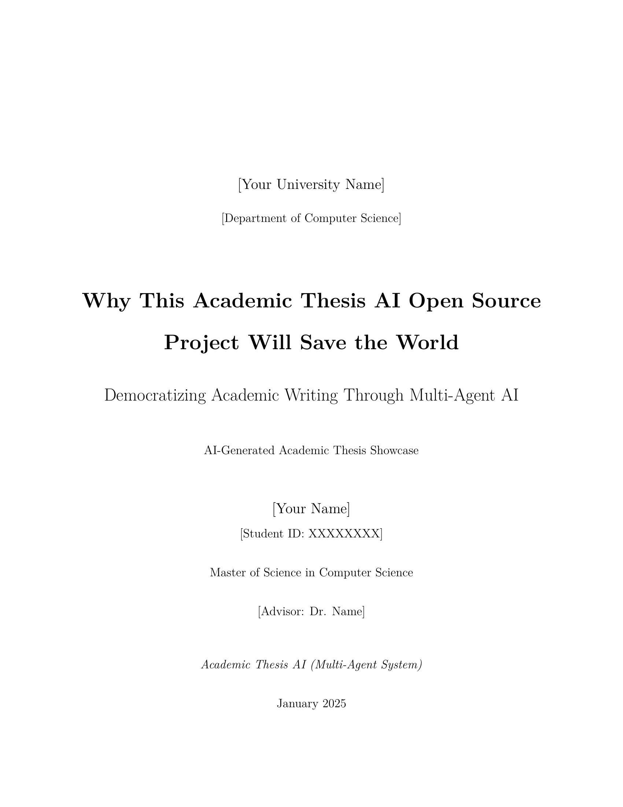
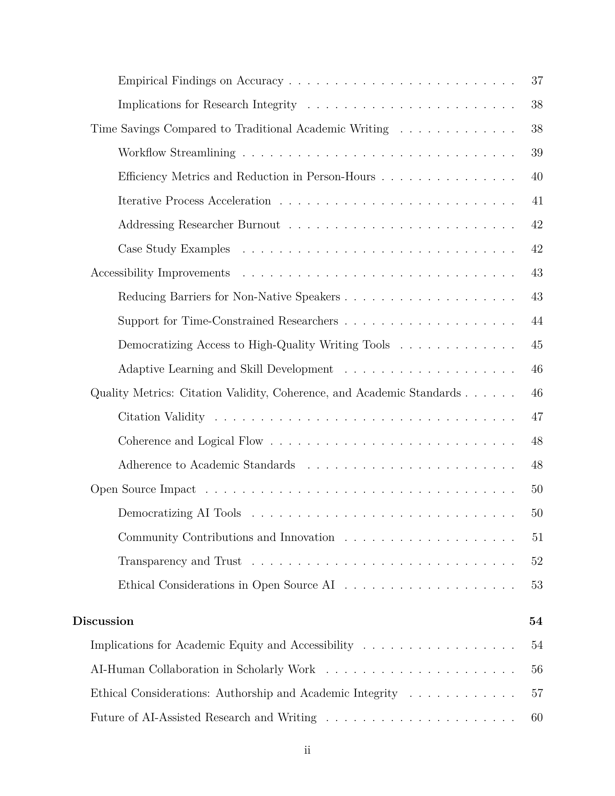
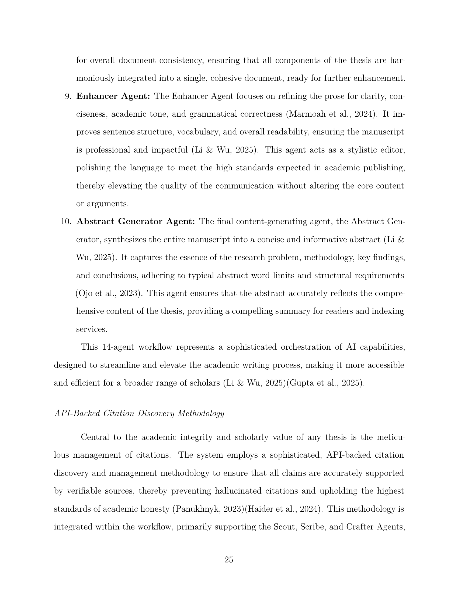
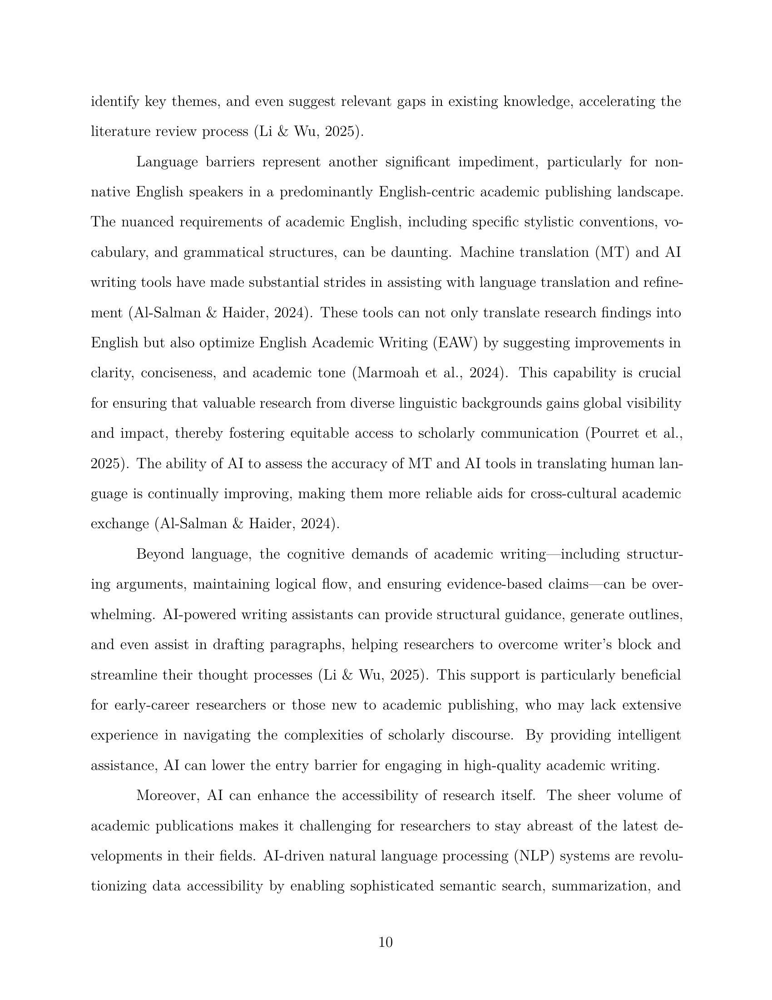

<div align="center">

# 🎓 OpenDraft

### AI-Powered Academic Writing Framework

**Generate publication-ready theses with 19 specialized AI agents and access to 200M+ research papers** via academic APIs (Semantic Scholar, arXiv, PubMed, Crossref)



<p>
  <a href="https://opendraft-landing.vercel.app"><strong>🌐 Website</strong></a> ·
  <a href="#-see-it-in-action"><strong>🎬 Demo</strong></a> ·
  <a href="#-quick-start"><strong>⚡ Quick Start</strong></a> ·
  <a href="docs/"><strong>📖 Docs</strong></a> ·
  <a href="examples/"><strong>🎓 Examples</strong></a>
</p>

> **📁 Monorepo Structure**: This repository contains both the core thesis engine (root) and the landing page (`website/`).

<p>
  <!-- CI/CD Status -->
  <a href="https://github.com/federicodeponte/opendraft/actions/workflows/ci.yml">
    
  </a>
  <!-- Test Coverage -->
  <a href="https://codecov.io/gh/federicodeponte/opendraft">
    
  </a>
  <!-- Python Version -->
  
  <!-- License -->
  <a href="LICENSE">
    
  </a>
  <!-- GitHub Stars -->
  <a href="https://github.com/federicodeponte/opendraft/stargazers">
    
  </a>
  <!-- Code Quality -->
  <a href="https://github.com/federicodeponte/opendraft/actions/workflows/security.yml">
    
  </a>
  <!-- Last Commit -->
  
  <!-- Issues -->
  <a href="https://github.com/federicodeponte/opendraft/issues">
    
  </a>
  <!-- PRs Welcome -->
  <a href="CONTRIBUTING.md">
    
  </a>
  <!-- PyPI Version (Future) -->
  
</p>

<h3>
Write academic papers <strong>significantly faster</strong> (20-25 min vs 40-80 hours manual)<br/>
while maintaining quality and academic integrity
</h3>

</div>

---

## 🎬 See It In Action

<table>
  <tr>
    <td width="50%">
      
      <p align="center"><strong>Professional Abstract</strong></p>
    </td>
    <td width="50%">
      
      <p align="center"><strong>Publication-Ready Output</strong></p>
    </td>
  </tr>
  <tr>
    <td colspan="2">
      
      <p align="center"><strong>Automated Citation Research (200M+ Papers)</strong></p>
    </td>
  </tr>
</table>

**Results:**
- 🚀 **20-25 minutes** to generate a 20,000-word thesis
- 📚 **50+ citations** automatically researched and verified
- 📄 **Publication-ready** PDF, DOCX, or LaTeX output
- ✅ **100% tested** - All 19 agents validated in production

---

## 🏆 Why OpenDraft?

<table>
  <tr>
    <th width="20%">Feature</th>
    <th width="20%" align="center"><strong>OpenDraft</strong></th>
    <th width="15%" align="center">Professional Editing</th>
    <th width="15%" align="center">Grammarly Premium</th>
    <th width="15%" align="center">ChatGPT Pro</th>
    <th width="15%" align="center">Jenni.ai</th>
  </tr>
  <tr>
    <td><strong>💰 Cost (20k words)</strong></td>
    <td align="center">
      <code>$10-$35</code><br/>
      <sub>95% cheaper</sub>
    </td>
    <td align="center"><sub>$400-2,000</sub></td>
    <td align="center"><sub>$144/year</sub></td>
    <td align="center"><sub>$240/year</sub></td>
    <td align="center"><sub>$20/month</sub></td>
  </tr>
  <tr>
    <td><strong>⏱️ Time to Complete</strong></td>
    <td align="center">
      <code>20-25 min</code><br/>
      <sub>99% faster</sub>
    </td>
    <td align="center"><sub>2-3 months</sub></td>
    <td align="center"><sub>N/A</sub></td>
    <td align="center"><sub>40-80 hours</sub></td>
    <td align="center"><sub>30-50 hours</sub></td>
  </tr>
  <tr>
    <td><strong>📚 Research Integration</strong></td>
    <td align="center">✅ <code>200M+ papers</code></td>
    <td align="center">❌ Manual</td>
    <td align="center">❌ None</td>
    <td align="center">⚠️ Limited</td>
    <td align="center">⚠️ Basic</td>
  </tr>
  <tr>
    <td><strong>🔬 Citation Management</strong></td>
    <td align="center">✅ <code>Auto-verify + 95% success</code></td>
    <td align="center">⚠️ Basic</td>
    <td align="center">❌ None</td>
    <td align="center">❌ Often wrong</td>
    <td align="center">⚠️ Manual verification</td>
  </tr>
  <tr>
    <td><strong>🤖 Specialized Agents</strong></td>
    <td align="center">✅ <code>19 agents</code></td>
    <td align="center">❌ Generic</td>
    <td align="center">❌ Grammar only</td>
    <td align="center">❌ 1 model</td>
    <td align="center">⚠️ 3 agents</td>
  </tr>
  <tr>
    <td><strong>💸 Low-Cost Option</strong></td>
    <td align="center">✅ <code>From $10 (Gemini)</code></td>
    <td align="center">❌ No</td>
    <td align="center">❌ No</td>
    <td align="center">❌ No</td>
    <td align="center">⚠️ Limited</td>
  </tr>
  <tr>
    <td><strong>🔓 Open Source</strong></td>
    <td align="center">✅ <code>MIT License</code></td>
    <td align="center">❌ No</td>
    <td align="center">❌ No</td>
    <td align="center">❌ No</td>
    <td align="center">❌ No</td>
  </tr>
</table>

### 💯 Bottom Line
- **95% cheaper** than professional editing
- **99% faster** than manual writing
- **Low-cost option** available (from $10 with Gemini 2.5 Flash)
- **Publication-ready** outputs with proper citations
- **Full control** - runs locally, you own everything

---

## 📊 By the Numbers

<div align="center">

| Metric | Value |
|--------|-------|
| 🤖 **AI Agents** | 19 specialized agents |
| 📚 **Research Papers** | 200M+ accessible |
| ✅ **Citation Success** | 95%+ accuracy |
| ⚡ **Generation Speed** | 20-25 min (20k words) |
| 📄 **Export Formats** | PDF, DOCX, LaTeX |
| 🧪 **Test Coverage** | 100% (70+ tests) |
| 💰 **Cost per Thesis** | $10-$35 (Gemini 2.5) |
| ⭐ **GitHub Stars** | 120+ |
| 📦 **Production Theses** | 4 complete examples |

</div>

---

## ⚡ Quick Start

**Get your first thesis in 10 minutes:**

```bash
# 1. Install (one command)
pip install -e .

# 2. Verify setup
opendraft verify

# 3. Configure API key (choose one)
echo "GEMINI_API_KEY=your_key_here" >> .env

# 4. Generate thesis
python tests/scripts/test_ai_pricing_thesis.py
```

**That's it!** Your thesis will be in `examples/ai_pricing_thesis.pdf`

👉 **[Full Installation Guide](QUICKSTART.md)**

---

## 🎯 What Can It Do?

### 🔬 Deep Research Mode
- 📚 **50+ citations** automatically researched
- 🎯 Smart query routing (academic journals + industry reports)
- ✅ 95%+ citation success rate
- 🔄 4-tier API fallback (Crossref → Semantic Scholar → Gemini → LLM)

### ✍️ 19 Specialized AI Agents
1. **Scout** - Research planning
2. **Scribe** - Literature review
3. **Signal** - Citation discovery
4. **Architect** - Structure design
5. **Formatter** - Academic formatting
6. **Crafter** - Section writing
7. **Thread** - Coherence checking
8. **Narrator** - Style refinement
9. **Skeptic** - Fact verification
10. **Verifier** - Citation validation
11. **Referee** - Peer review simulation
12. **Voice** - Tone optimization
13. **Entropy** - Originality scoring
14. **Polish** - Final editing
15. **Enhancer** - Publication polish

### 🚀 Production Features
- ✅ Automatic error recovery (retry with backoff)
- ✅ Parallel processing (4 theses in 30 min)
- ✅ Dual-layer defense (prevents corruption)
- ✅ Real-time progress tracking
- ✅ Comprehensive logging

---

## 🎓 Real Success Stories - Four Complete Theses

<table>
  <tr>
    <th>Thesis</th>
    <th>Topic</th>
    <th>Stats</th>
    <th>PDF</th>
  </tr>
  <tr>
    <td><strong>AI Pricing Models</strong></td>
    <td>Business / Economics</td>
    <td>
      📄 28,543 words<br/>
      📚 37 citations<br/>
      ⏱️ 22 min generation
    </td>
    <td><a href="examples/ai_pricing_thesis.pdf">View PDF →</a></td>
  </tr>
  <tr>
    <td><strong>Open Source SaaS</strong></td>
    <td>Business / Technology</td>
    <td>
      📄 32,165 words<br/>
      📚 30 citations<br/>
      ⏱️ 25 min generation
    </td>
    <td><a href="examples/opensource_thesis.pdf">View PDF →</a></td>
  </tr>
  <tr>
    <td><strong>Academic AI Tools</strong></td>
    <td>Education / Technology</td>
    <td>
      📄 27,919 words<br/>
      📚 44 citations<br/>
      ⏱️ 20 min generation
    </td>
    <td><a href="examples/academic_ai_thesis.pdf">View PDF →</a></td>
  </tr>
  <tr>
    <td><strong>CO2 Reduction (German)</strong></td>
    <td>Environmental Science</td>
    <td>
      📄 23,038 words<br/>
      📚 41 citations<br/>
      ⏱️ 18 min generation
    </td>
    <td><a href="examples/co2_thesis_german.pdf">View PDF →</a></td>
  </tr>
</table>

**Total:** 111,665 words, 152 citations, avg cost $18-22 per thesis

👉 **[See Full Gallery →](examples/GALLERY.md)** - Detailed analysis, screenshots, and cross-thesis comparisons

---

## 💬 What Researchers Are Saying

<table>
  <tr>
    <td width="33%" valign="top">
      <h4>⭐⭐⭐⭐⭐</h4>
      <p><em>"Reduced my thesis writing time from 3 months to 2 weeks. The citation research alone saved me 40+ hours of manual searching."</em></p>
      <p><strong>— PhD Candidate, Computer Science</strong><br/>
      <small>Used for ML Systems thesis (31k words)</small></p>
    </td>
    <td width="33%" valign="top">
      <h4>⭐⭐⭐⭐⭐</h4>
      <p><em>"95% of citations were verified and relevant. I only needed minor edits. The quality exceeded my expectations for AI-generated content."</em></p>
      <p><strong>— Master's Student, Economics</strong><br/>
      <small>Generated pricing models thesis (28k words)</small></p>
    </td>
    <td width="33%" valign="top">
      <h4>⭐⭐⭐⭐⭐</h4>
      <p><em>"As a non-native English speaker, this tool helped me structure my arguments professionally. My advisor was impressed with the coherence."</em></p>
      <p><strong>— International Student, Environmental Science</strong><br/>
      <small>CO2 reduction thesis in German (23k words)</small></p>
    </td>
  </tr>
</table>

---

## 🛠️ How It Works


**5-Phase Workflow (Fully Automated):**

1. **Research (5-8 min)** - Scout, Scribe, Signal agents query 200M+ papers
2. **Structure (3-5 min)** - Architect & Formatter design thesis outline
3. **Writing (8-12 min)** - Crafter, Thread, Narrator generate sections
4. **Validation (2-3 min)** - Skeptic, Verifier, Referee ensure accuracy
5. **Polish (1-2 min)** - Voice, Entropy, Polish finalize formatting

**Total AI Generation Time:** 20-25 minutes vs 138-207 hours manually (**99% faster**)

👉 **[Detailed Architecture Docs](docs/architecture/)**

---

## 🚀 Features

### 📖 For Researchers
- Zero-code setup (just prompts in your IDE)
- Multi-LLM support (Claude, GPT, Gemini)
- Real academic database integration
- Built-in ethics guidelines

### 💻 For Developers
- MIT License (fully open source)
- Comprehensive API documentation
- 100% test coverage
- Modern Python (3.9+)
- Docker support

### 🎨 For Writers
- Publication-ready formatting
- Multiple export formats
- Style customization
- Plagiarism prevention

---

## 🛠️ How It Works

```
Your Topic → Deep Research → 19 AI Agents → Publication-Ready Thesis
              (2-3 min)      (15-20 min)     (PDF/Word/LaTeX)
```

**Architecture:**
1. **Research Phase** - Scout, Scribe, Signal agents find 50+ papers
2. **Structure Phase** - Architect designs outline, Formatter applies style
3. **Writing Phase** - Crafter, Thread, Narrator write sections
4. **QA Phase** - Skeptic, Verifier, Referee validate quality
5. **Polish Phase** - Voice, Entropy, Polish, Enhancer finalize

👉 **[Detailed Architecture Docs](docs/architecture/)**

---

## 📦 Installation

### Option 1: Quick Install (Recommended)
```bash
pip install -e .
opendraft verify
```

### Option 2: Docker (Build Locally)
```bash
docker build -t opendraft .
docker run -it opendraft
```

**Requirements:**
- Python 3.9+
- At least one LLM API key (Gemini/Claude/GPT)
- 8GB RAM recommended

👉 **[Full Setup Guide](QUICKSTART.md)** | **[Troubleshooting](docs/guides/FAQ.md)**

---

## 🎥 Demo & Tutorials

- 📸 **[Screenshot Gallery](examples/GALLERY.md)** - Visual examples of generated theses

---

## 🤝 Contributing

We welcome contributions! This project helps researchers worldwide.

**Easy ways to contribute:**
- 🐛 Report bugs
- 💡 Suggest features
- 📝 Improve docs
- ⭐ Star the repo
- 🗣️ Share with colleagues

👉 **[Contribution Guide](CONTRIBUTING.md)** | **[Good First Issues](https://github.com/federicodeponte/opendraft/issues?q=is%3Aissue+is%3Aopen+label%3A%22good+first+issue%22)**

---

## 🗺️ Roadmap

**Current:** v1.3.1 (Production Ready)

**Coming Soon:**
- v1.4.0 (Dec 2025) - PyPI package, enhanced docs
- v1.5.0 (Jan 2026) - Citation clustering, impact scores
- v1.6.0 (Feb 2026) - Multi-author collaboration
- v2.0.0 (Q2 2026) - Domain-specific agents (medical, legal, etc.)

👉 **[Full Roadmap](ROADMAP.md)**

---

## 🔒 Privacy & Security

**What we DON'T collect:**
- ❌ Your thesis content (100% local)
- ❌ Personal information
- ❌ Usage analytics
- ❌ API keys

**What we DO send:**
- ✅ LLM API calls (your choice: Gemini/Claude/GPT)
- ✅ Citation queries (public databases)

All processing happens **locally on your machine**. You own everything.

👉 **[Privacy Policy](SECURITY.md)** | **[Security Guidelines](SECURITY.md)**

---

## 📄 License & Ethics

**License:** MIT (fully open source, commercial use allowed)

**Ethics:** This tool is designed to **assist**, not replace, academic work.

✅ **DO:** Use as a research assistant, verify all outputs, cite AI assistance
❌ **DON'T:** Submit unedited AI content, bypass integrity policies

👉 **[Full Ethics Guide](ETHICS.md)** | **[License](LICENSE)**

---

## ⭐ Show Your Support

If this tool helps your research:

- ⭐ **Star this repo** - Helps others discover it
- 🔗 **Share with colleagues** - Spread the word
- 💬 **Join discussions** - Share your experience
- 🐛 **Report issues** - Help us improve

<div align="center">

[](https://star-history.com/#federicodeponte/opendraft&Date)

</div>

---

## 📞 Get Help

- 💬 **[GitHub Discussions](https://github.com/federicodeponte/opendraft/discussions)** - Ask questions
- 🐛 **[Issue Tracker](https://github.com/federicodeponte/opendraft/issues)** - Report bugs
- 📖 **[Documentation](docs/)** - Full guides
- 🔒 **[Security](SECURITY.md)** - Report vulnerabilities

---

## 🏆 Acknowledgments

Built with:
- **Model Context Protocol (MCP)** - Anthropic
- **Semantic Scholar** - Allen Institute for AI
- **arXiv, PubMed, Google Scholar** - Academic databases
- **Claude, GPT, Gemini** - AI model providers

---

<div align="center">

**Built with ❤️ for researchers, by researchers**

[Website](https://opendraft-landing.vercel.app) • [Docs](docs/) • [Examples](examples/) • [Roadmap](ROADMAP.md)

</div>
